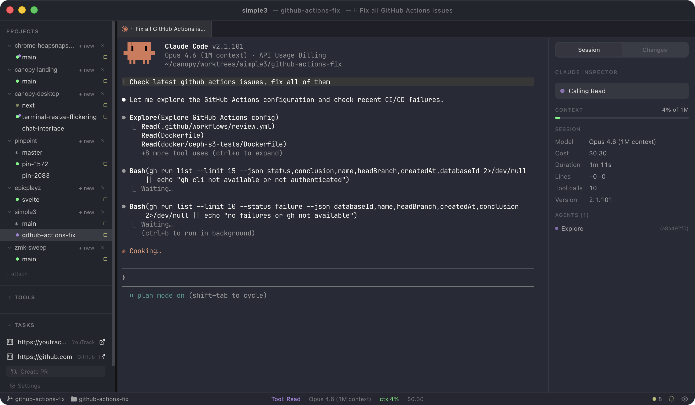

  

<h1 align="center">Canopy</h1>

<h3 align="center">One canopy. Every branch.</h3>

  A workstation for developers who run AI agents across multiple projects at once.

  Built at IT SOL, where we run Claude Code across dozens of PR branches daily.

  <a href="https://github.com/itsoltech/canopy-desktop/releases/latest">Download for Free</a> &bull;
  <a href="https://canopy.itsol.tech">Website</a> &bull;
  <a href="https://github.com/itsoltech/canopy-desktop/issues">Issues</a>

---

  

## Everything you need, nothing you don't

### GPU-accelerated terminal

WebGL-powered rendering, drag & drop panel splits, tabs, and persistent sessions that remember your setup. Rearrange panes by dragging them where you need them. Your shell config works out of the box.

### Claude Code integration

Built in, not bolted on. Real-time Inspector panel tracks costs, context usage, tool calls, and tasks per session. Configure your API provider, model, permission mode, and system prompts from Preferences. AI-powered commit message generation included.

### Session status in the notch

On macOS, a notch overlay shows live Claude session status. Color-coded indicators (green for idle, orange for working, red for permission needed) auto-peek when state changes. Hover to expand and see per-session workspace, branch, and status. Click a row to focus that window.

### Git & worktree management

Your branches, your worktrees, all visible at a glance. One-click worktree creation with automated setup actions. Push, pull, fetch, stash, commit from the sidebar. Branch management with merge status indicators.

### Multi-project workspaces

Multiple projects in one window with persistent layouts that remember your exact configuration. All open projects and the active worktree restore automatically after app updates. Welcome Dashboard for quick access to recent projects.

### Built-in browser

Each worktree gets its own browser tab with element and screenshot capture for AI agents. Switch branches, switch context, your test page follows.

### Tool launcher & command palette

Launch Claude Code, LazyGit, Codex, Gemini, OpenCode, or any custom tool. Add your own CLI tools with custom commands, arguments, icons, and categories. Keyboard-first command palette puts every action at your fingertips.

## Three agents. Three branches. One screen.

Create a worktree from any branch. Launch Claude Code in its context. Open more worktrees, run more agents in parallel. Each session gets its own terminal, inspector, and browser tab. Switch between them from one screen.

## Free. No subscription. No account. No middleman.

Canopy is not an editor and not a terminal. It is a workstation for managing AI-powered development across multiple branches simultaneously. Your API keys, your Claude Code license, your Codex or Gemini setup. You manage them, we don't touch them.

## Download

- **macOS** — DMG or ZIP (code signed & notarized, Apple Silicon + Intel)
- **Windows** — NSIS installer
- **Linux** — AppImage or DEB

**[Download Canopy](https://github.com/itsoltech/canopy-desktop/releases/latest)** — free, source-available, cross-platform.

Auto-updates built in.

## Tech stack

Electron &bull; Svelte 5 &bull; TypeScript &bull; xterm.js &bull; node-pty &bull; SQLite &bull; simple-git

## License

Source-available under the [Canopy Source-Available License v1.0](LICENSE.md). Free to use for any purpose, commercial or personal.

Copyright (c) 2026 IT SOL Sp. z o.o.
